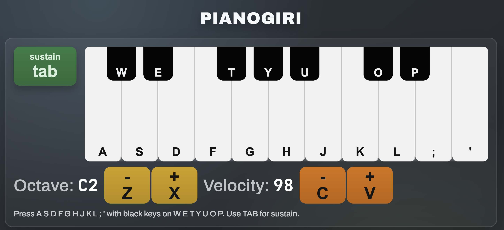

# PianoGiri

A fast, browser-based virtual piano with keyboard controls, sustain, velocity, octave switching, and realistic sampled grand-piano sound.

## Features

- Real-time play from your computer keyboard
- Grand-piano sampled sound engine (Tone.js + Salamander samples)
- Sustain toggle (Tab)
- Octave control (Z/X)
- Velocity control (C/V)
- Responsive UI for desktop and mobile
- Ad-ready layout (top and bottom slots)
- GA4 event tracking hooks for growth and conversion analysis

## Keyboard Mapping

### White keys

- A S D F G H J K L ; '

### Black keys

- W E T Y U O P

### Controls

- Sustain: Tab
- Octave down: Z
- Octave up: X
- Velocity down: C
- Velocity up: V

## Octave Behavior

The displayed octave labels are calibrated so `C1` on the UI sounds as concert-style `C4`, matching your intended reference.

## Tech Stack

- HTML, CSS, JavaScript
- Web Audio via Tone.js
- Sample set: Salamander piano samples loaded from CDN

### Tracking Events (GA4)

The app emits these events when GA4 is configured:

- `play_start`
- `first_note`
- `session_30s`
- `notes_progress`
- `sustain_toggle`
- `octave_change`
- `velocity_change`

## Notes

- Internet connection is required for CDN-loaded Tone.js and piano samples.
- If ad/analytics IDs are empty, the app still works normally (safe no-op behavior).
